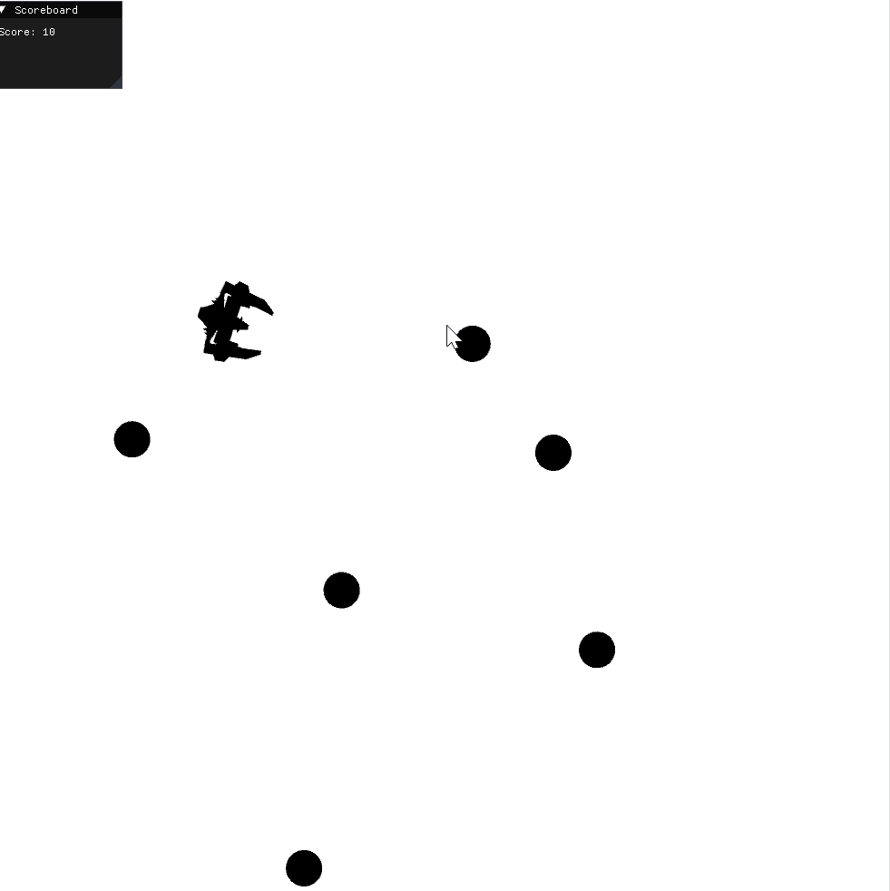
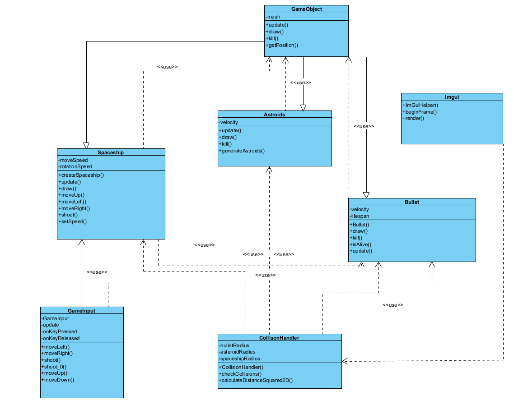

### 10049
# Asteroid Game
 

#### 2D asteroid game built using C++, Threepp, and ImGui. Control a spaceship to dodge and destroy asteroids, track your score, and get the highest score

##### This is a project in the subject AIS1003. It has 7 heder files,6 source files and 3 test files.

## Gameplay

## Gameplay Instructions
- Use **W**, **A**, **D** to move your spaceship:
  - `W` to move forward.
  - `A` to rotate left.
  - `D` to rotate right.
- Press **Spacebar** to shoot bullets.
- Avoid or destroy asteroids to survive and score points.

## UML Diagram
